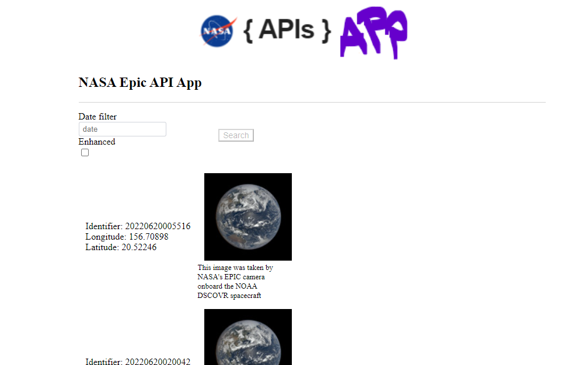

# nasa-api-app-example

A quick show-case of using golang and svelte as a secure data providing application

Utilizes a [NASA EPIC API](https://epic.gsfc.nasa.gov/about/api) for data.

## Usage

**Backend:**

-requires a docker service running

```
cd src/backend
make start
```

**Frontend:**

- requires nodejs >=15

```
cd src/frontend
npm install
npm run serve
```

Example should be traversable at http://localhost:3000

## Resources

Golang:

- https://github.com/zephinzer/godev
- https://github.com/gorilla/mux

Svelte:

- https://svelte.dev/
- https://github.com/Greenheart/pagecrypt
- https://vitejs.dev/
- https://github.com/Greenheart/svelte-encrypted-spa
- https://github.com/seeschweiler/svelte-todo-app
- https://github.com/davidturissini/svelte-data-demo

UI screenshot:


